# Some Code SDK

This project holds the latest list of **["Some code"](https://www.some-code.com/)** actions and connections
The purpose of this project is to help developers to design new actions according to their needs.

> **Note:** Although it is possible to create actions and connections using some-code interface, SDK provides more connivent way of trouble shooting the above

# Installation

```bash
npm install
```

> **Note:** Only executable actions can be created.

The easiest way to create a new action is to copy existing action and amend the metadata files accordingly

# Actions

## Action dialogue

This dialogue is created dynamically during runtime based on the metadata

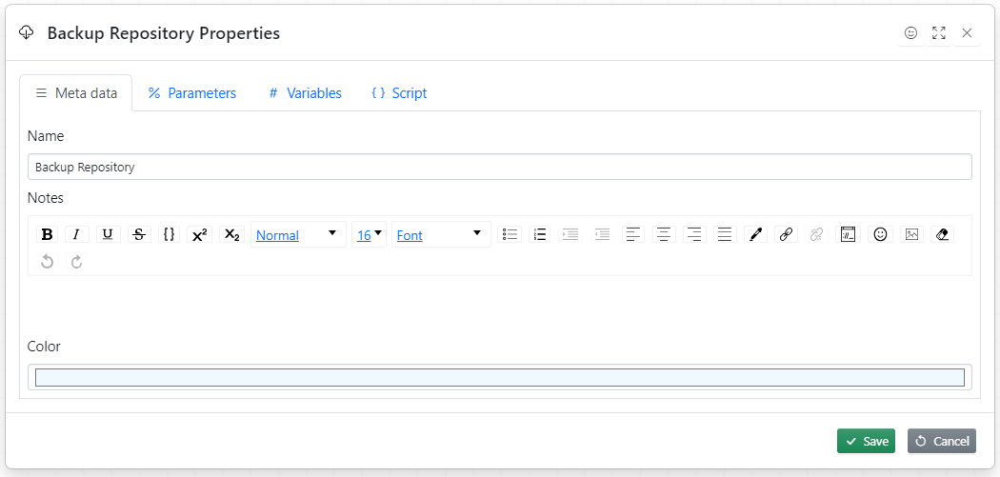

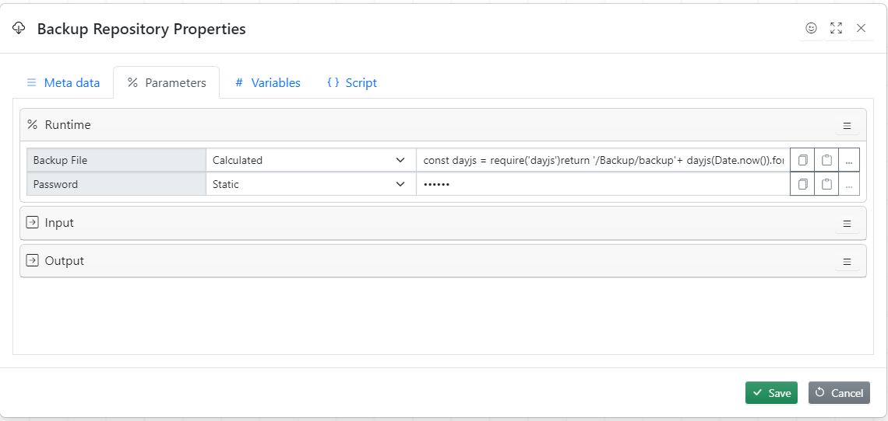

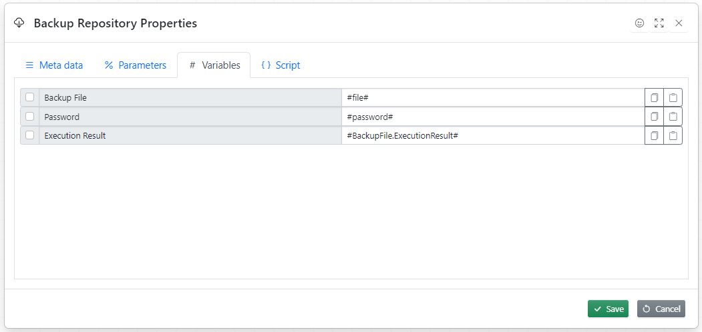

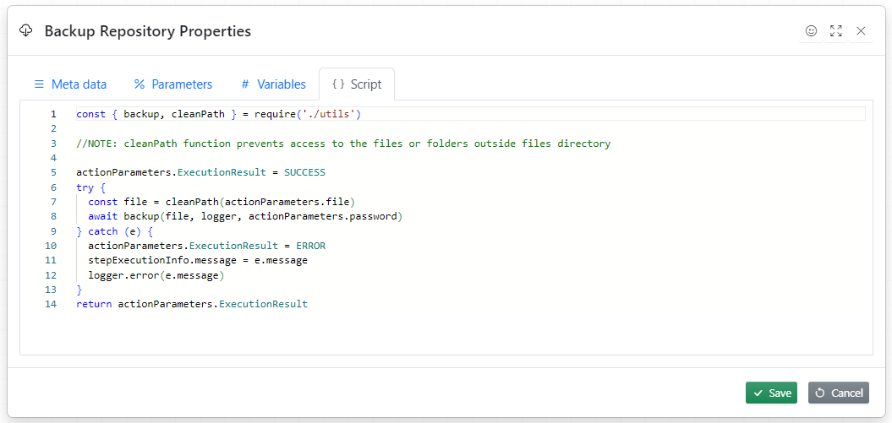

## Action designer

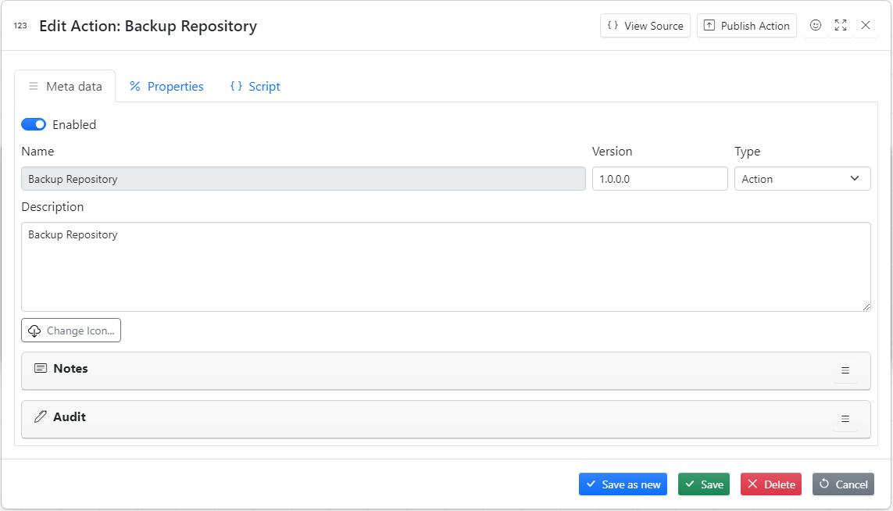

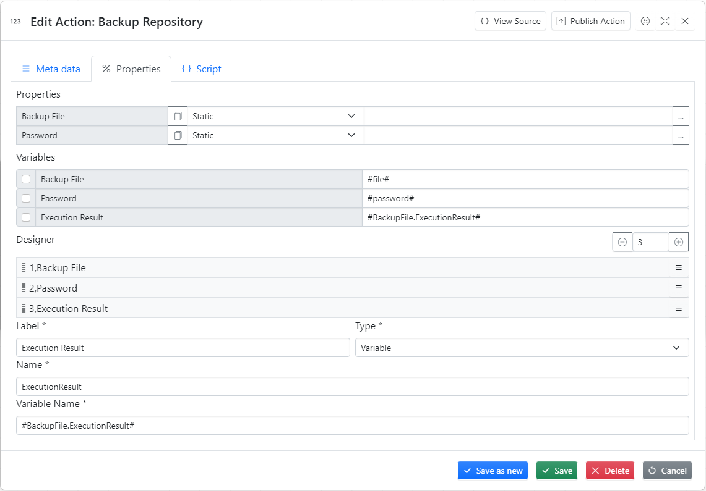

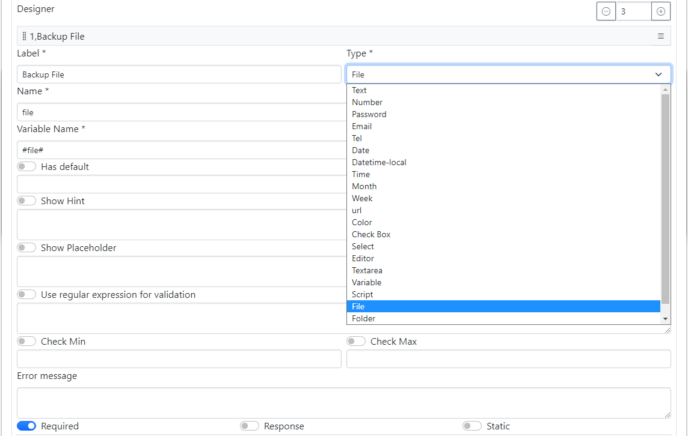

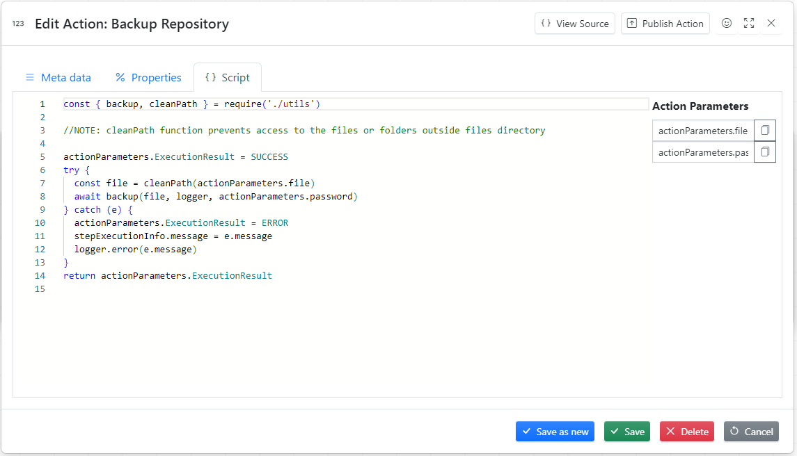

## Action metadata files

1. Action icon (svg) file must match the folder name.
2. metaDataDefinition.json - holds a definition of the Metadata tab
3. metaData.json - Action metadata file
4. properties.json holds action parameters, Parameters and Variables tab
5. actionScript.js, the script executed by action, Script tab

# Connections

Connection defines list of parameters used by a credential. For example the database connection must have database name, user and password and credential is the actual values for database name, user and password

## Credential dialogue

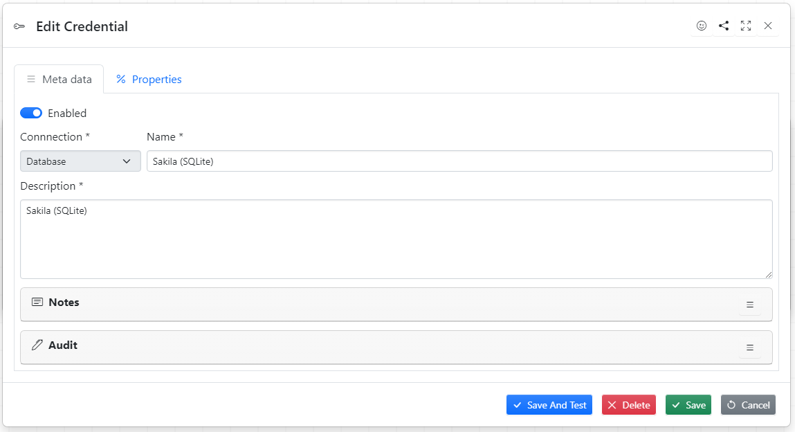

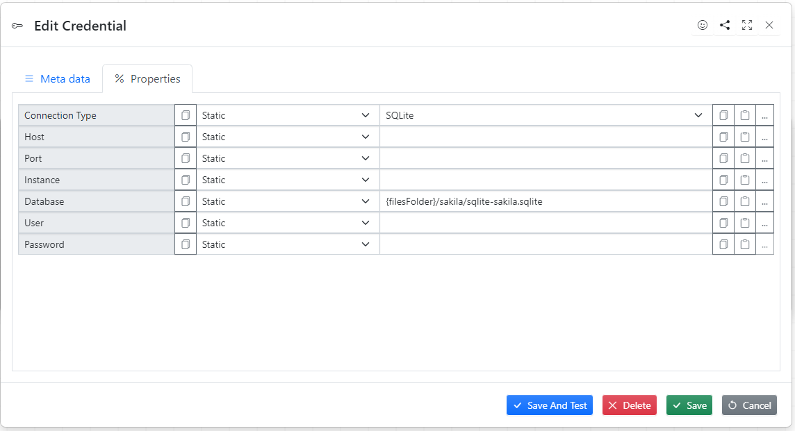

## Connection designer

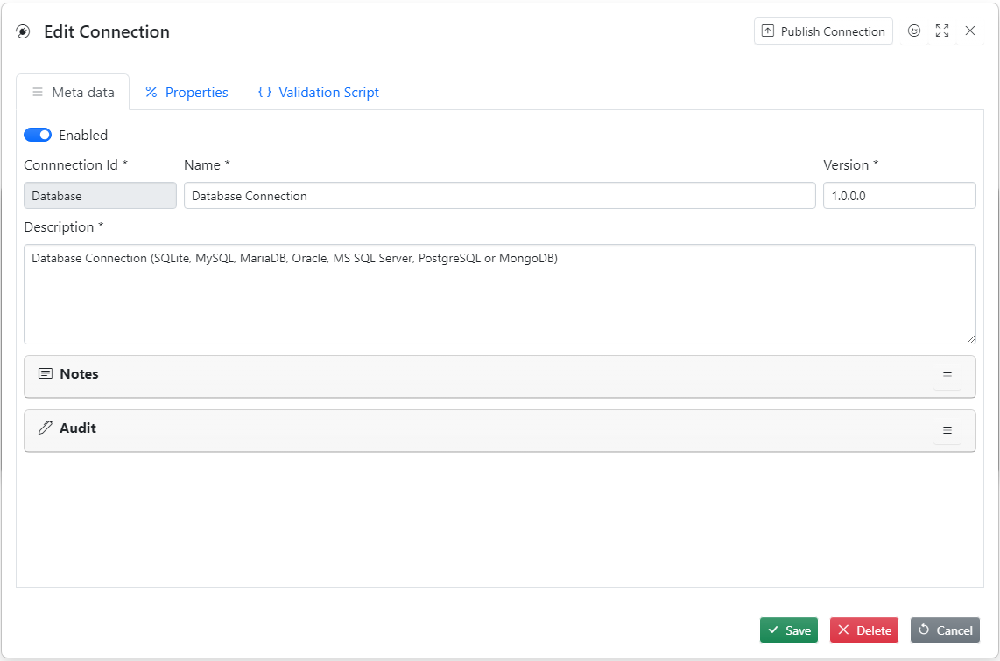

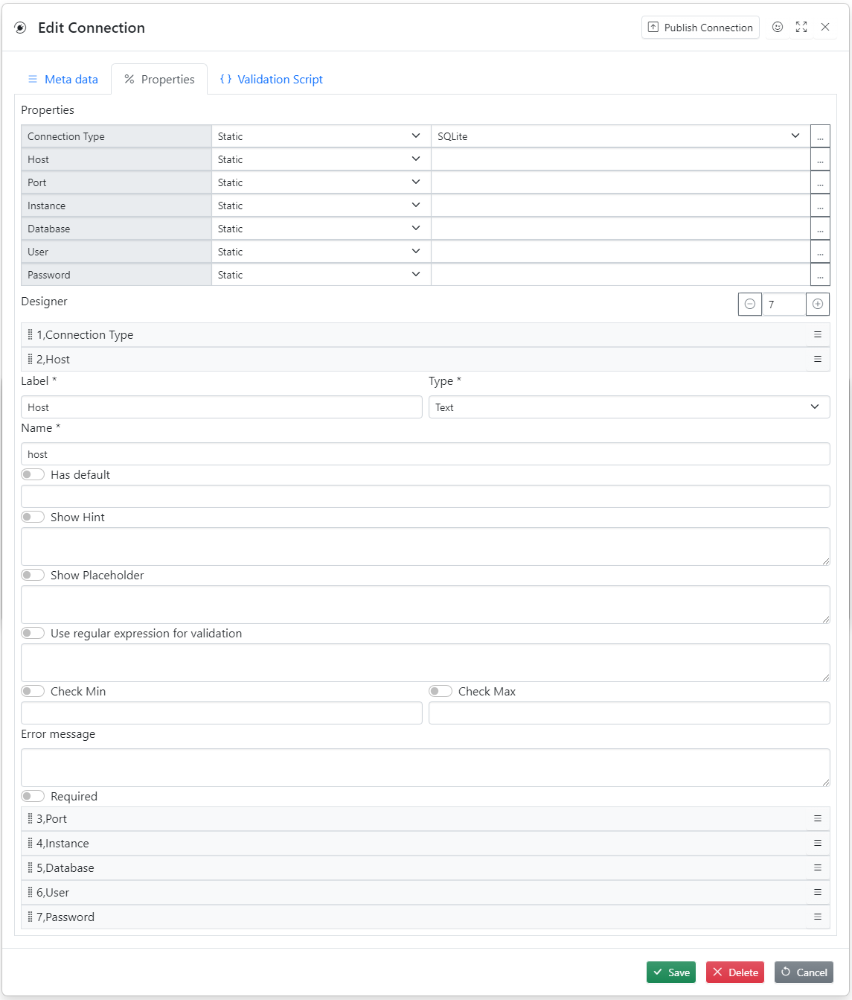

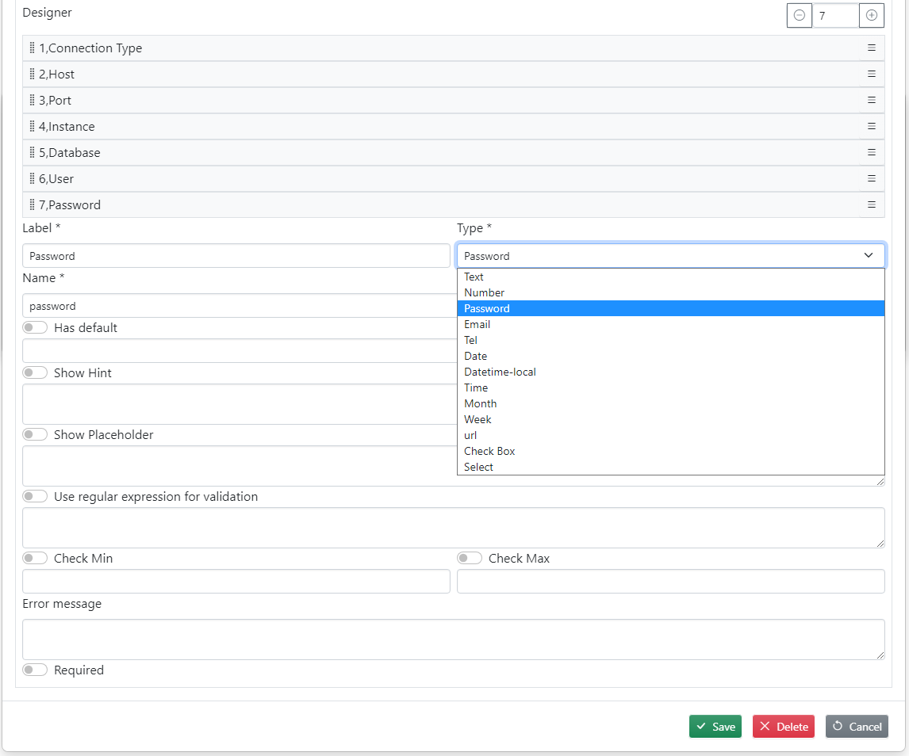

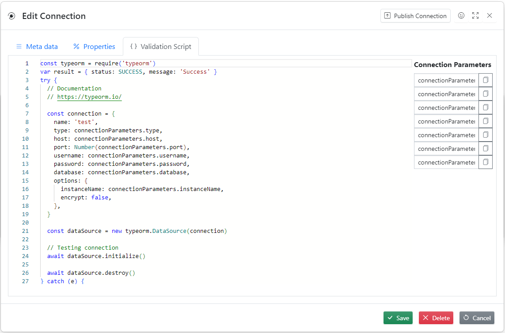

## Connection metadata files

1. metaData.json, connection metadata file
2. properties.json, connection parameters, Properties tab
3. validationScript.js, this script is used for connection validation, Validation Script tab

# .env file parameters

These are used for testing and running utilities, self explanatory

CONNECTION_TYPE=sqlite
DB_HOST=
DB_PORT=
DB_USER=
DB_PASS=
DB_NAME=../../some-code/backend/data/db/some-code-repository.sqlite
DB_INSTANCE=
PUBLIC_FOLDER=../../some-code/backend/public/

KAFKA_HOST=
KAFKA_PORT=

FTP_HOST=
FTP_PORT=
FTP_USER=
FTP_PASSWORD=

SMTP_HOST=
SMTP_PORT=
SMTP_USER=
SMTP_PASSWORD=

SQL_CONNECTION_TYPE=sqlite
SQL_DB_HOST=
SQL_DB_PORT=
SQL_DB_USER=
SQL_DB_PASS=
SQL_DB_NAME=./sakila/sqlite-sakila.sqlite
SQL_DB_INSTANCE=

MQTT_PROTOCOL=mqtt://
MQTT_HOST=
MQTT_PORT=
MQTT_USER=
MQTT_PASS=~

RABBITMQ_HOST=
RABBITMQ_VHOST=
RABBITMQ_PORT=
RABBITMQ_USER=
RABBITMQ_PASS=

# Utilities

**Note:** Before running utilities amend env parameters so they point to the right repository

## Backing up actions

```
npm run actions-backup
```

## Restoring actions

```
npm run actions-restore
```

## Backing up connections

```
npm run actions-connections
```

## Restoring connections

```
npm run actions-connections
```

## Running tests

```
npm run test
```

or if you want to test handles

```
npm run test-handles
```

**Note:** The tests are run sequentially

## Testing on linux

Compress/ Decompress actions tests might fail due to the lack of access rights.
Run the following command in terminal to address the issue

```bash
chmod +x node_modules/7zip-bin/linux/x64/7za
```

# Executing single action

Use index.js as an example

# Project web site

https://www.some-code.com/

# License

MIT
